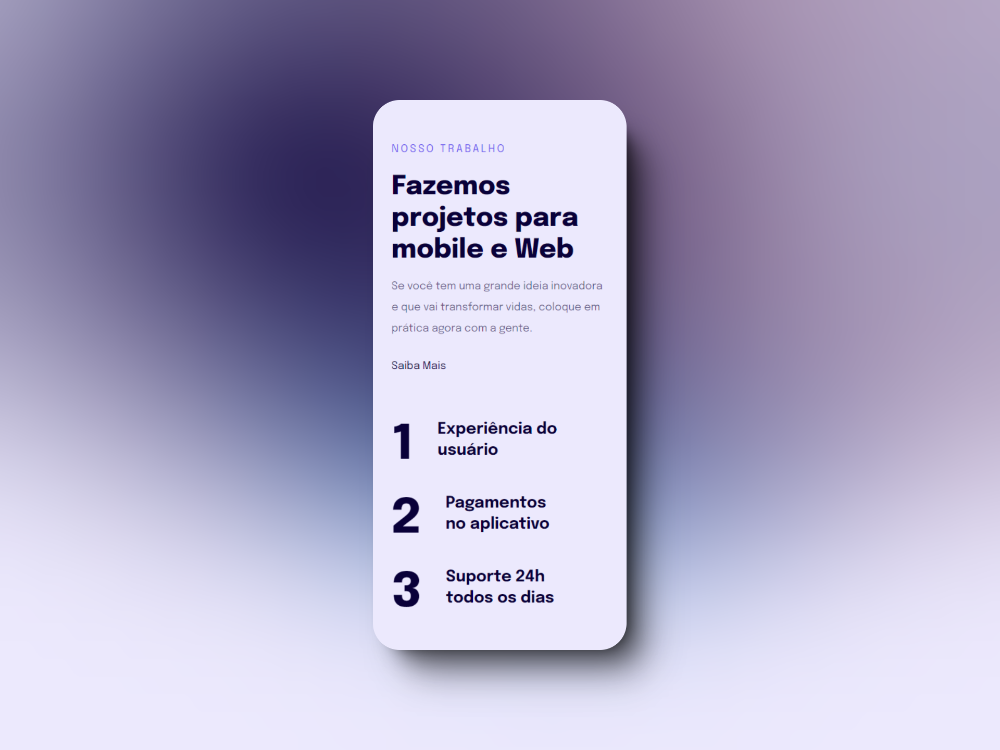

<h1 align="center"> Mobile first </h1>

  <a href="#-tecnologias">Tecnologias</a>&nbsp;&nbsp;&nbsp;|&nbsp;&nbsp;&nbsp;
  <a href="#-projeto">Projeto</a>&nbsp;&nbsp;&nbsp;|&nbsp;&nbsp;&nbsp;
  <a href="#-aprendizado">Aprendizado</a>&nbsp;&nbsp;&nbsp;&nbsp;&nbsp;&nbsp;

 

  

## 🚀 Tecnologias

Esse projeto foi desenvolvido com as seguintes tecnologias:

- HTML e CSS
- Git e Github
- Figma

## 💻 Projeto

Neste projeto Rocketseat foi feito uma interface para desktop e mobile, com o intuito de estudar fundamentos sobre responsividade, acessibilidade e customização com html e css, onde, foi desafiado a reprodução de um layout pelo figma com os conceitos aprendidos em aula. Espero que gostem!

- [Acesse o projeto finalizado, online](https://luriserdan.github.io/responsividade-mobile-first/)

## 🔖 Aprendizado

- Regra Mobile First
- Responsividade com Root EM
- Uso de Media Queries

Feito com ♥ by Luri Serdan